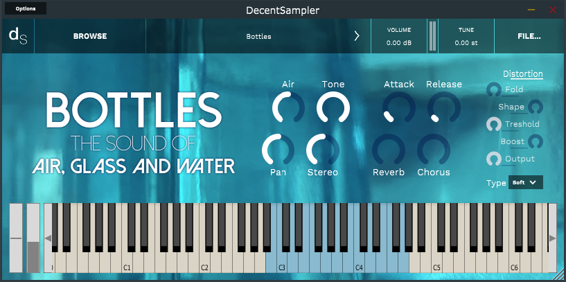

# Bottles - The Sound of Air, Glass and Water
Bottles is a library for Decent Sampler. Decent Sampler is available for free for **Windows**, **Linux** and **MacOS**. You can get the plugin for free at www.decentsamples.com (https://www.decentsamples.com/product/decent-sampler-plugin/)

A minimum version of Decent Sampler 1.7.2 is required to use this library.

The library features padlike sounds made by blowing into glass bottles filled with water.

---

## Key Features
* Two voices for more or less airflow noises
* Four round robin variations for each sample
* Inbuilt effects
* Keyswitches to enable or disable effects on demand
* You may experience childhood memories

---

## Interface

---

### Knobs
**Air:** Move seamlessly from less airflow noises to more. Will reset **Stereo** when used.

**Tone:** Lowpass filter to filter out even more airflow noises, if desired 

**Pan:** Pan the sound left or right. Will reset **Stereo** when used.

**Stereo:** Stereo seperation for the two voices. Will reset **Pan** and **Air** when used.

**Attack:** Increase or decrease the attack time.

**Release:** Increase or decrease the release time.

**Reverb:** Increase or decrease the reverb time. Reverb can be disabled dynamically with [`Keyswitches`](###Keyswitches)

**Chorus:** Increase or decrease the chorus effect. Chorus can be disabled dynamically with [`Keyswitches`](###Keyswitches)

---

### Distortion

Applies a distortion effect to the output signal. 

**Fold:** Increase or decrease the drive for wavefolding distortion

**Shape:** Increase or decrease the drive for waveshaping distortion

**Threshold:** Controls the amplitude above which wavefolding takes place

**Boost:** Changes the characteristics of waveshaping distortion.
Caution: Higher boost usually results in louder output. Use **Output** to balance the output level.

**Output:** Controls the output level of the distorted signal.

**Type:** Distortion type. Can be disabled dynamically with [`Keyswitches`](###Keyswitches)
- **Soft:** Distortion applied per voice group. Usually results in a cleaner distortion than **Hard**
- **Hard:** Distotion applied to the whole instrument. Usually results in a more guttural distortion sound than **Soft**
- **Off:** Disable distortion completely

---

## Keyboard
### Playable Range
**Standard Range:** Light Blue (B2 to G4)
- Different recorded samples for each whole step

**Extended Range:** Gray (C0 to A#2 and G#4 to B6)
- Uses a single sample for each range for more versatility. May not sound as good as Standard Range

### Keyswitches
**Red:** Set Distortion Type
- **C-2:** Set type to **Soft**
- **D-2:** Set type to **Hard**
- **E-2:** Disable distortion

**Green:** Reverb
* **F-2:** Disable Reverb
* **G-2:** Disable Reverb

**Purple_** Chorus
* **A-2:** Disable Chorus
* **B-2:** Disable Chorus

